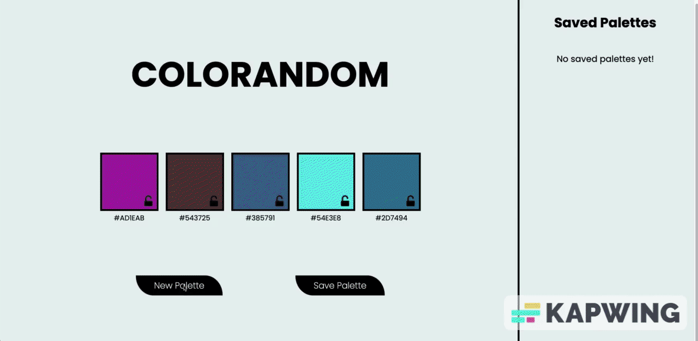

# COLORANDOM

### Abstract:
[//]: <> (Briefly describe what you built and its features. What problem is the app solving? How does this application solve that problem?)
Do you need a custom color palette for your website? How about visualizing how different colors work together for your next digital art project?
This application assists designers generate and save custom palettes of 5 colors and their hex-codes.
- The application generates a random set of five colors on load, and each time the New Palette button is clicked.
- Each color can be locked in by clicking the ‘lock icon’ so as new palettes are generated, those locked colors won’t change. Colors can also be unlocked after being locked in.
- Users can save palettes by clicking the Save Palette button to the right side of the screen.
- When users save palettes, they are prompted to give them a name which saves itself to the palette.
- Users can delete palettes using the ‘X’ button in the Saved Palettes area. Users will be asked if they are certain they wish to delete the palette. 
- They can confirm or exit the modal that appears.
- Users can pull a saved palette back to the main area by clicking on the saved palette they wish to see. The name and hex-codes of that saved palette will appear in the main area with those colors.
- Users are not able to save an exact same palette, or a palette with the same name as a previously saved palette.

### Installation Instructions:
[//]: <> (What steps does a person have to take to get your app cloned down and running?)
1. fork this repository https://github.com/SethBurns/coloRandom
2. Clone down your new, forked repo using the generated SSH link in the terminal
3. cd into the repository
4. Open it in your text editor
5. View app in the browser by running open index.html in your terminal

### Preview of App:

### Context:
[//]: <> (Give some context for the project here. How long did you have to work on it? How far into the Turing program are you?)
The project was assigned on 2023.04.10, and was completed by 2023.04.17, the project worked and responded as intended. There was 6 required iterations that needed to be implemented into the project, a basic layout, generating random palettes, locking + unlocking colors, saving palettes, deleting saved palettes and editing saved palettes. Once the required features are implemented additional features can be implemented as long as the original features function as intended. The project was issued in the 4th week of Turing's Mod1. 

### Contributors:
[//]: <> (Who worked on this application? Link to their GitHubs.)
[Jason Alberto](https://github.com/jalbe0076), [Seth Burns](https://github.com/SethBurns) & [Matt Fowler](https://github.com/mbenfowler) worked on this application. 

### Learning Goals:
[//]: <> (What were the learning goals of this project? What tech did you work with?)
The learning goals of the project was to gain experience experience writing HTML, CSS and JavaScript as a team by utilizing GitHub. The styling specifications were provided in the project comp. The HTML and CSS were written in a way to have JavaScript manipulate it through the DOM to display and respond to user events. VS code was the text editor used to write the HTML, CSS and JavaScript. GitHub was used as a hosting platform and was used to organize tickets that each group member could pickup. Merges into main were completed with clean code, meaning no broken or dead code was merged into the main branch. Each merge required the other two members to review, this was to ensure all members got more experience reviewing code they did not write as well as to ensure all new code was understood before merging.

### Wins + Challenges:
[//]: <> (What are 2-3 wins you have from this project? What were some challenges you faced - and how did you get over them?)

#### Wins:
- Easily satisfied basic project requirements, leaving us a lot of time to experiment with extra features/new concepts!
- Project Management with Projects was very effective
- Our front-loaded norming efforts really empowered us to complete most of our work async, saving our scheduled face-to-face time for setting daily goals and code reviews when new concepts were introduced.

#### Challenges:
- Modal work
	- This required us to explore Promises/async functions to effectively handle waiting for user input within our event listeners.
- Merge conflicts galore
	- There were some very hairy merge conflicts we had to work through together as we were up to 3 developers now working quite intimately within the same 3 files.
- Time-zone differences of team members
